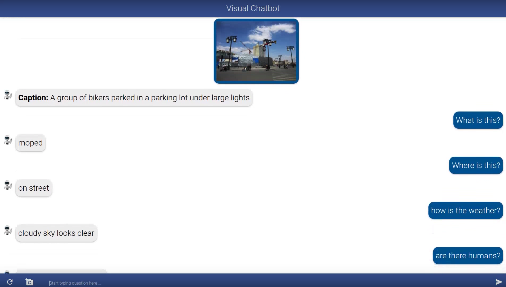

Visual Chatbot
============
Demo for the paper (**Now upgraded to Pytorch, for the Lua-Torch version please see [commit](https://github.com/Cloud-CV/visual-chatbot/tree/f5db5a099cba044a6dee3830fa25a66ef4f1b08b)**). 

**[Visual Dialog][1]**  (CVPR 2017 [Spotlight][4]) </br>
Abhishek Das, Satwik Kottur, Khushi Gupta, Avi Singh, Deshraj Yadav, José M. F. Moura, Devi Parikh, Dhruv Batra  
Arxiv Link: [arxiv.org/abs/1611.08669][1]  
Live demo: http://visualchatbot.cloudcv.org

[](http://www.youtube.com/watch?v=SztC8VOWwRQ&t=13s "Visual Chatbot")

Introduction
---------------
**Visual Dialog** requires an AI agent to hold a meaningful dialog with humans in natural, conversational language about visual content. Given an image, dialog history, and a follow-up question about the image, the AI agent has to answer the question. Putting it all together, we demonstrate the first ‘visual chatbot’!

What has changed since the last version?
---------------------------------------------------
The model-building code is completely shifted to Pytorch, we have put in a much improved [Bottom Up Top Down][12] captioning model from [Pythia][10] and Mask-RCNN feature extractor from [maskrcnn-benchmark][13]. The Visdial model is borrowed from [visdial-challenge-starter][14] code. 

Please follow the instructions below to get the demo running on your local machine. For the previous version of this repository which supports Torch-Lua based models see [commit](https://github.com/Cloud-CV/visual-chatbot/tree/f5db5a099cba044a6dee3830fa25a66ef4f1b08b). 

Setup and Dependencies
------------------------------
Start with installing the Build Essentials , [Redis Server][5] and [RabbiMQ Server][6].
```sh
sudo apt-get update

# download and install build essentials
sudo apt-get install -y git python-pip python-dev
sudo apt-get install -y autoconf automake libtool 
sudo apt-get install -y libgflags-dev libgoogle-glog-dev liblmdb-dev
sudo apt-get install -y libprotobuf-dev libleveldb-dev libsnappy-dev libopencv-dev libhdf5-serial-dev protobuf-compiler

# download and install redis-server and rabbitmq-server
sudo apt-get install -y redis-server rabbitmq-server
sudo rabbitmq-plugins enable rabbitmq_management
sudo service rabbitmq-server restart 
sudo service redis-server restart
```

#### Environment Setup

You can use Anaconda or Miniconda to setup this code base. Download and install Anaconda or Miniconda distribution based on Python3+ from their [downloads page][17] and proceed below. 


```sh
# clone and download submodules
git clone https://github.com/Cloud-CV/visual-chatbot.git
git submodule update init --recursive

# create and activate new environment
conda create -n vischat python=3.6.8
conda activate vischat

# install the requirements of chatbot and visdial-starter code
cd visual-chatbot/
pip install -r requirements.txt
```

#### Downloads
Download the BUTD, Mask-RCNN and VisDial model checkpoints and their configuration files.
```sh
sh viscap/download_models.sh
```

#### Install Submodules
Install Pythia to use BUTD captioning model and maskrcnn-benchmark for feature extraction. 
```sh
# install fastText (dependency of pythia)
cd viscap/captioning/fastText
pip install -e .

# install pythia for using butd model
cd ../pythia/
sed -i '/torch/d' requirements.txt
pip install -e .

# install maskrcnn-benchmark for feature extraction
cd ../vqa-maskrcnn-benchmark/
python setup.py build
python setup.py develop
cd ../../../
```
#### Cuda Installation

Note: CUDA and cuDNN is only required if you are going to use GPU. Download and install CUDA and cuDNN from [nvidia website][18].  

#### NLTK
We use `PunktSentenceTokenizer` from nltk, download it if you haven't already. 
```sh
python -c "import nltk; nltk.download('punkt')"
```


## Let's run this now! 
#### Setup the database
```
# create the database
python manage.py makemigrations chat
python manage.py migrate
```
#### Run server and worker
Launch two separate terminals and run worker and server code.   
```sh
# run rabbitmq worker on first terminal
# warning: on the first-run glove file ~ 860 Mb is downloaded, this is a one-time thing
python worker_viscap.py

# run development server on second terminal
python manage.py runserver
```
You are all set now. Visit http://127.0.0.1:8000 and you will have your demo running successfully.

## Issues
If you run into incompatibility issues, please take a look [here][7] and [here][8]. 

## Model Checkpoint and Features Used
Performance on `v1.0 test-std` (trained on `v1.0` train + val):

  Model  |  R@1   |  R@5   |  R@10  | MeanR  |  MRR   |  NDCG  |
 ------- | ------ | ------ | ------ | ------ | ------ | ------ |
[lf-gen-mask-rcnn-x101-demo][20]  | 0.3930 | 0.5757 | 0.6404 | 18.4950| 0.4863 | 0.5967 |

Extracted features from `VisDial v1.0` used to train the above model are here: 

- [features_mask_rcnn_x101_train.h5][21]: Mask-RCNN features with 100 proposals per image train split.
- [features_mask_rcnn_x101_val.h5][22]: Mask-RCNN features with 100 proposals per image val split.
- [features_mask_rcnn_x101_test.h5][23]: Mask-RCNN features with 100 proposals per image test split.

*Note*: Above features have key `image_id` (from earlier versions) renamed as `image_ids`.

## Cite this work

If you find this code useful, consider citing our work:

```
@inproceedings{visdial,
  title={{V}isual {D}ialog},
  author={Abhishek Das and Satwik Kottur and Khushi Gupta and Avi Singh
    and Deshraj Yadav and Jos\'e M.F. Moura and Devi Parikh and Dhruv Batra},
  booktitle={Proceedings of the IEEE Conference on Computer Vision and Pattern Recognition},
  year={2017}
}
```

## Contributors
* [Rishabh Jain][24] (rishabhjain@gatech.edu)
* [Yash Kant][19] (ysh.kant@gmail.com)
* [Deshraj Yadav][2] (deshraj@gatech.edu)
* [Abhishek Das][3] (abhshkdz@gatech.edu)

## License

BSD

## Credits and Acknowledgements

- Visual Chatbot Image: "[Robot-clip-art-book-covers-feJCV3-clipart](https://commons.wikimedia.org/wiki/File:Robot-clip-art-book-covers-feJCV3-clipart.png)" by [Wikimedia Commons](https://commons.wikimedia.org) is licensed under [CC BY-SA 4.0](https://creativecommons.org/licenses/by-sa/4.0/deed.en)
- The beam-search implementation was borrowed as it is from [AllenNLP](15).
- The vqa-maskrcnn-benchmark code used was forked from @meetshah1995's [fork](16) of the original repository.
- The VisDial model is borrowed from [visdial-starter-challenge ][14].
- The BUTD captioning model comes from this awesome repository [Pythia][10].

[1]: https://arxiv.org/abs/1611.08669
[2]: http://deshraj.github.io
[3]: https://abhishekdas.com
[4]: http://cvpr2017.thecvf.com/
[5]: https://redis.io/
[6]: https://www.rabbitmq.com/
[7]: https://github.com/unbit/uwsgi/issues/1770
[8]: https://stackoverflow.com/questions/41335478/importerror-no-module-named-asgiref-base-layer
[9]: https://gitlab.com/yashkant/vqa-maskrcnn-benchmark](https://gitlab.com/yashkant/vqa-maskrcnn-benchmark)
[10]: https://github.com/facebookresearch/pythia/
[11]: https://github.com/facebookresearch/fastText/
[12]: https://arxiv.org/abs/1707.07998
[13]: https://github.com/facebookresearch/maskrcnn-benchmark
[14]: https://github.com/batra-mlp-lab/visdial-challenge-starter-pytorch/
[15]: https://www.github.com/allenai/allennlp
[16]: https://gitlab.com/meetshah1995/vqa-maskrcnn-benchmark/
[17]: https://conda.io/docs/user-guide/install/download.html
[18]: https://developer.nvidia.com/cuda-downloads
[19]: https://github.com/yashkant
[20]: https://s3.amazonaws.com/visual-dialog/data/v1.0/2019/lf_gen_mask_rcnn_x101_train_demo.pth
[21]: https://s3.amazonaws.com/visual-dialog/data/v1.0/2019/features_mask_rcnn_x101_train.h5
[22]: https://s3.amazonaws.com/visual-dialog/data/v1.0/2019/features_mask_rcnn_x101_val.h5
[23]: https://s3.amazonaws.com/visual-dialog/data/v1.0/2019/features_mask_rcnn_x101_test.h5
[24]: https://rishabhjain2018.github.io/


